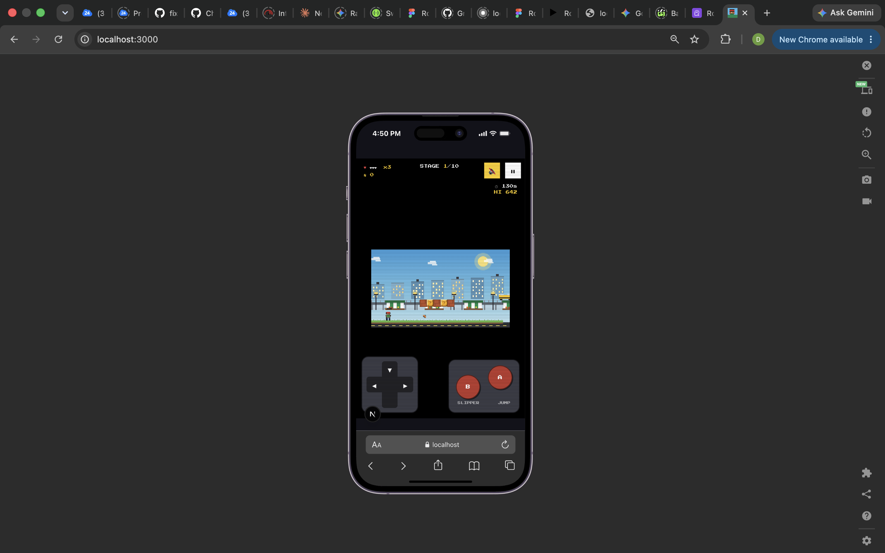
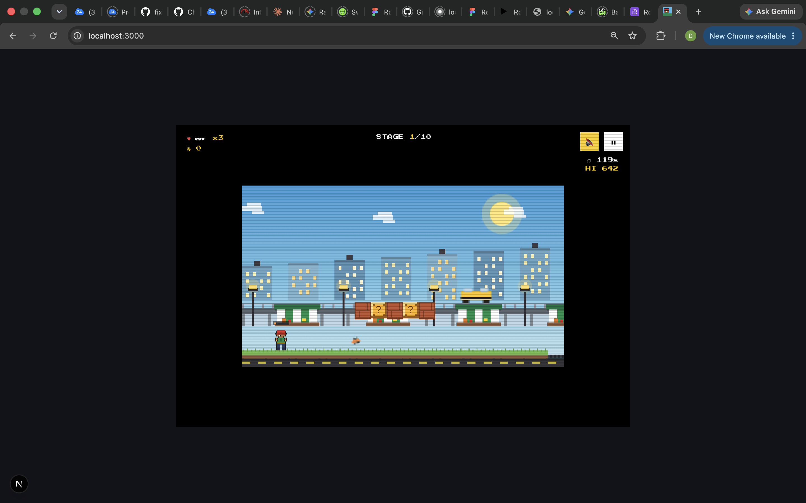

# Super Emeka

A retro, pixel-art side-scrolling platformer set on the streets of Lagos. Think classic Mario physics and structure, but the coins are Naira, the power-ups are Suya and Cold Zobo, the enemies are hawkers and Agberos running a toll, and the level goal is boarding a yellow Danfo bus. Built with Next.js and a hand-rolled HTML5 Canvas game engine — no game framework (no Phaser), no image assets, no audio files. Everything you see and hear is generated in code.

This document is written so that anyone — human or AI — landing on this repo cold can understand what's here, why it's built the way it is, and where to pick up next. It's long on purpose. Skim the headings, read the sections you need.

## Screenshots

<p align="center">
  
  &nbsp;&nbsp;
  
</p>

## Status: playable, not "finished"

You can `npm install && npm run dev` right now and play a full 10-stage run start to finish. The core loop works, the audio works, mobile controls work, and the whole thing has been manually verified with a headless-browser playtest (see the "Testing notes" section — there's no automated test suite, this was all exploratory/manual verification during development).

What it isn't: production-hardened, accessibility-audited, or backed by real art/music assets. It's a solid, complete vertical slice that plays well, built entirely through iterative conversation — the "Design decisions and lessons learned" section below tells that story, because it explains *why* several things are tuned the way they are, and that context will save you from re-breaking things that were already fixed once.

## Quick start

```bash
npm install
npm run dev      # http://localhost:3000
npm run build    # production build + typecheck
npm run start    # serve the production build
```

No environment variables, no external services, no database. It's a fully static/client-rendered game — the only persistent state is `localStorage` (high score + mute preference), scoped per browser.

## The tech stack, and why

- **Next.js 16 (App Router) + React 19 + TypeScript** — just for the app shell (start screen, HUD, modals) and dev tooling. The game itself doesn't use React for anything performance-sensitive.
- **Tailwind CSS** — all the UI chrome (buttons, modals, HUD boxes) is Tailwind utility classes with a pixel-art aesthetic (hard borders, drop shadows instead of blur, a monospace pixel font).
- **Raw HTML5 Canvas 2D** — the actual game (world, sprites, physics, camera) is a self-contained engine in `game/`, driven by its own `requestAnimationFrame` loop, completely independent of React's render cycle. React just mounts a `<canvas>` and hands it off.
- **Web Audio API, zero audio files** — music and every sound effect are synthesized live with oscillators and a generated noise buffer. See the audio section below for why.
- **No Phaser, no Howler, no sprite sheets** — a deliberate choice made at the start. It keeps the bundle tiny, sidesteps any licensing questions around reproducing Mario-like assets, and — more importantly — it means the whole game is just readable TypeScript. There is nothing binary in this repo except `package-lock.json`.

Package versions are pinned in `package.json`; notably we're on Next 16.3.5 / React 19 rather than the more tutorial-common Next 14, because at the time this was built, Next 14.x had an unresolved critical `npm audit` advisory and 16.3.5 was the first fully clean version. If you're reading this much later, it's worth re-running `npm audit` and considering whether to bump further — nothing here depends on Next-14-specific behavior.

## How the game actually works (as a player)

- **Controls** — Arrow keys/WASD to move, Space/Up/W to jump, Down/S to crouch, X/F/Shift to throw. On touch devices, a Game Boy-style overlay appears automatically: a D-pad plus red **A** (jump) and **B** (slipper throw) buttons.
- **Goal** — get to the yellow Danfo bus at the end of each stage (it has a bouncing arrow over it so it's never ambiguous) before the timer runs out. There are **10 stages**, each longer and harder than the last. Clearing one shows a brief banner and rolls straight into the next; score, Naira, and lives carry over, but health and the clock reset per stage.
- **Hazards** — potholes (2 tiles wide) and open drainages (3 tiles wide) in the road; both are lethal if you walk/fall into them, but both are jumpable by design (see the jump-tuning story below).
- **Enemies** — Hawkers patrol back and forth and die in one hit. Agberos are tougher (2 hits), block the path in a "traffic gridlock" barricade near the end of each stage, and always have a low bridge nearby so you can hop over them entirely instead of fighting. Enemies get faster on later stages.
- **Combat** — stomp on an enemy's head (classic Mario-style), or throw a slipper at it from a distance. The slipper throw has a ~1.6s cooldown shown as a small bar over the character's head, specifically so it can't replace jumping as the main way through a level.
- **Items** — hit a "?" block from below to get a Naira coin, a Suya (+1 health), or a Cold Zobo (temporary speed boost). Floating coins scattered through the air are free-standing collectibles, no block required.
- **Progression** — 3 lives, falling/dying respawns you at your last grounded checkpoint (not the start of the stage). Run out of lives or run out of time and it's game over; either way you see a summary with which stage you reached, and a high score (persisted in `localStorage`) that can be broken.

## Project structure

```
app/                          Next.js App Router shell
  layout.tsx                  Root layout, loads the pixel font, sets metadata
  page.tsx                    THE state machine — start/howtoplay/playing/paused/
                               gameover/levelclear, owns the AudioManager instance,
                               wires HUD <-> GameCanvas <-> modals together
  globals.css                 Tailwind + a few retro touches (scanlines, pixelated rendering)
  icon.svg                    Favicon (procedural, not a binary asset)

components/game/               React UI layer — all "chrome," none of it touches game logic directly
  GameCanvas.tsx               Owns the <canvas>, creates/destroys a GameEngine instance,
                               handles responsive integer-scaling so pixel art stays crisp
  HUD.tsx                      Lives/health/naira/timer/stage indicator + the stage-clear banner
  TouchControls.tsx            Game Boy-style D-pad + A/B buttons for touch devices
  StartScreen.tsx / HowToPlayModal.tsx / PauseOverlay.tsx
  GameOverModal.tsx / StageClearModal.tsx
  MuteButton.tsx

game/                          The engine. Framework-agnostic, no React/DOM assumptions
                               beyond a CanvasRenderingContext2D and window events.
  types.ts                     Shared types: GamePhase, HudState, InputState, EndSummary
  engine/
    constants.ts                Every tunable number lives here — physics, sizes, timings.
                                 Read the comment block above the physics constants before
                                 touching jump/gravity values; it explains the reachability math.
    GameEngine.ts                THE orchestrator: game loop, collision resolution, stage
                                 transitions, scoring, rendering. This is the biggest file
                                 and the one you'll spend the most time in.
    Level.ts                     Procedural level generator — see below, this replaced a
                                 hand-authored level and is probably the most interesting file.
    Player.ts                    Player movement/animation state machine
    Entities.ts                  Enemy, Pickup, FloatingCoin, Projectile classes
    Physics.ts                   AABB collision, tile-grid sweep, ledge/wall detection helpers
    Camera.ts                    Simple hard-follow camera, clamped to level bounds
    Input.ts                     Keyboard + touch input, merged into one InputState per frame
    Sprites.ts                   Every pixel-art sprite, authored as character grids (see below)
    Background.ts                Parallax background layers (skyline, bridge, market stalls)
  audio/
    AudioManager.ts              Web Audio API wrapper — music sequencer + all SFX synthesis
    chiptunes.ts                 The (original, not copied) melody/bassline/percussion data
  utils/
    storage.ts                   localStorage high-score read/write
```

## Deep dive: the parts worth understanding before you change them

### The jump-height math (read this before touching physics constants)

Early in development, the level had blocks and coins placed 3-7 tiles above the ground while the jump could only reach ~1.6 tiles. Everything above head height was literally unreachable. The fix wasn't just "jump higher" — it was making the physics and the level generator agree on the same numbers.

The rule now: **`constants.ts` defines the jump envelope, and `Level.ts` is written against it, not the other way around.**

```
max jump height = JUMP_VELOCITY² / (2 × GRAVITY)  ≈ 53px ≈ 3.3 tiles of head-rise
horizontal range during a full jump ≈ 63px ≈ 4 tiles
```

From that: blocks/coins sit 1–3 tiles above standing head height (never higher), gaps never exceed 3 tiles, and every Agbero barricade has a low bridge that's a comfortable 1-2 tile hop, not a stretch jump. If you change `GRAVITY`, `JUMP_VELOCITY`, or `MOVE_SPEED`, re-check `Level.ts`'s row constants (`BLOCK_ROW_LOW/MID`, `BONUS_ROW`, `BYPASS_ROW`) and the gap-width logic, or you'll reintroduce the exact bug this fixed.

There's a second, subtler lesson baked into `JUMP_CUT_MULTIPLIER`. The game supports variable jump height (tap for a short hop, hold for a full jump) via clamping `vy` when the button is released early. The multiplier was originally `0.45`, which felt right in isolation but meant a quick, light tap — which is how a lot of casual/mobile players jump instinctively — didn't clear even the smallest 2-tile pothole. It's now `0.58`, tuned so a minimum-effort tap still clears the smallest gap with a few pixels to spare, while a 3-tile drainage gap still requires a real, committed jump. If you ever adjust this again, there's a tiny throwaway physics simulator described in the testing notes below that's worth resurrecting rather than eyeballing it.

### The procedural level generator (`Level.ts`)

Originally there was one hand-authored ~120-tile level. It's now a seeded procedural generator (`createLevel(stageNumber)`), because the game needed 10 stages of increasing difficulty and hand-authoring ten of these would not have scaled well (and would drift out of sync with the physics tuning above every time something changed).

How it works, roughly:
- A `mulberry32` seeded PRNG keyed on the stage number, so a given stage's layout is fixed and reproducible — not re-rolled on every play.
- Difficulty is a single `t = (stage-1)/9` value in `[0,1]` that scales: level length (110 → 300 tiles), hazard frequency, chance of the wider/harder drainage gap over a pothole, enemy speed multiplier, and how many Agbero barricades appear (1 on early stages, up to 3 on the hardest).
- The level is built as a left-to-right walk: alternating safe stretches (which might get a block cluster, a coin arc, or a patrolling hawker) and hazard gaps, with a forced minimum safe buffer after every gap so hazards never chain back-to-back into an unfair double-jump.
- Every Agbero barricade is placed together with its bypass bridge in one atomic step (`placeAgberoGate`), so the two can never get out of sync.
- The final stretch is always reserved and safe: guaranteed final barricade, guaranteed landing buffer, then the Danfo.

If you want a 11th stage, or want to make the curve steeper/gentler, this is almost entirely a matter of adjusting the `t`-based formulas near the top of `createLevel` — the placement logic underneath doesn't need to change.

One thing to know: reachability is guaranteed for the *ground-level* path and the *elevated bridge* path, but not exhaustively fuzz-tested across all 10 seeds. If a future difficulty tweak (e.g., a much higher `t` exponent) produces a stage that feels unfair, the first thing to check is whether `minSafe`/`maxSafe` shrank enough that two features (a block cluster and a coin arc, say) are landing on top of each other — see the comment in `placeCoinArc`/`placeBlockCluster` about why that's harmless for aerial features but would matter if you ever added ground-level obstacles.

### Sprites are typed pixel grids, not images

`Sprites.ts` defines every character/enemy/item as an array of strings — one character per pixel, mapped through a shared `PALETTE`. E.g., `PLAYER_IDLE` is a 14×20 grid of characters like `k` (outline), `b` (skin), `g` (jersey green). A tiny `seg(...)` helper builds each row from `[count, char]` pairs so row widths are verified by addition instead of by manually counting characters in a string — that sounds like a small thing, but hand-typing pixel-art strings is extremely easy to get subtly wrong (a row one character short silently shifts everything after it), and it happened more than once during development. If you add a new sprite, keep using `seg()`, and consider re-running the width-validator pattern described in the testing notes.

Sprite proportions matter more than they might seem: the character went through a full redesign because the first version (12×16, minimal detail) read as "a stump" rather than a person. The fix wasn't more pixels for their own sake — it was specifically adding a narrow neck row (separating head from shoulders), widening the hands beyond the forearm width, and giving the legs their own multi-row block distinct from the torso. If you redesign any character again, preserve those three things; they're what makes a small pixel sprite read as a figure instead of a blob.

### Audio is synthesized, not sampled

`AudioManager.ts` builds a master → (music gain / sfx gain) → destination graph, and every sound is generated at call time:
- SFX (jump, coin, stomp, power-up, hurt, game over, victory fanfare, slipper throw, block bump) are short oscillator envelopes, sometimes layered with a burst from one shared generated noise buffer (used for percussion and the stomp's "thud").
- Music is a hand-rolled step sequencer (`chiptunes.ts` holds the note/duration data for lead, bass, and percussion) scheduled via the standard Web-Audio lookahead pattern (`scheduleStep` looks ~120ms ahead on a `setTimeout` loop, not `setInterval`, to stay sample-accurate).
- The melody is original — deliberately not a transcription of the actual Super Mario theme, both for licensing cleanliness and because "inspired by" was the brief.

This means: zero loading time, zero bundle weight for audio, and zero external asset pipeline. The tradeoff is that it will never sound as rich as a produced track or recorded SFX — if a future version wants real music/audio, `AudioManager`'s public API (`playJump()`, `playCoin()`, etc.) is the seam to swap an oscillator call for an `<audio>`/sample-based one without touching any calling code in `GameEngine.ts`.

### The game engine's shape

`GameEngine` is a plain TypeScript class, constructed with a canvas, an `AudioManager`, and a couple of callbacks (`onHud`, `onEnd`). It owns:
- A fixed-timestep update loop (`FIXED_DT = 1/60`) accumulated against real elapsed time inside a single `requestAnimationFrame` loop — standard "accumulator" pattern, so physics stays stable regardless of display refresh rate.
- All game state: player, enemies, pickups, coins, projectiles, popups, camera, score/naira/lives, current stage, throw cooldown, and an optional "stage transition" mode (a short frozen banner period between stages, handled entirely inside the engine — React just renders whatever `HudState.banner` says).
- Rendering, done manually every frame: background parallax, tile-by-tile level draw (only the columns currently in view), entities back-to-front, then UI-ish overlays drawn directly on the canvas (the throw-cooldown bar over the player's head, the bouncing goal arrow over the Danfo).

React's only jobs are: mount/unmount the canvas (`GameCanvas.tsx`, keyed so "Play Again" gets a fresh engine instance), forward input events from on-screen buttons, and render the `HudState` snapshot the engine hands it once a frame (throttled by a shallow-equality check in `page.tsx` so the DOM doesn't re-render 60 times a second for numbers that mostly aren't changing).

## Design decisions and lessons learned (the "why" behind some choices)

A few things that look like they could be "cleaned up" but are actually deliberate:

- **Enemy `hit()` is shared between stomping and slipper-throwing.** It used to be called `stomp()`. When the throw mechanic was added, it made more sense to rename it to something direction-agnostic than to duplicate the health/knockback logic.
- **A successful stomp snaps the player's `y` to just above the enemy**, not just sets a bounce velocity. Without that snap, the very next physics tick could see the player and enemy still overlapping with `vy` now pointing *down* (post-bounce-reversal), which the collision code would misread as a fresh side-hit and immediately damage the player right after a successful stomp. This was a real bug, found and fixed during development — don't remove the snap as a "simplification."
- **`isSolidTile` treats out-of-bounds columns as solid and out-of-bounds rows as open.** This gives invisible walls at the far left/right edges of a level (so you can't walk off into the void sideways) while still letting you jump above the top of the screen or fall through the bottom (which is how death-by-falling is detected). Getting this backwards once caused an invisible ceiling bug where jumping high would suddenly "hit ground" — worth knowing if collision near level edges ever misbehaves again.
- **Touch-control detection is intentionally broad**, checking `pointer: coarse`, `maxTouchPoints`, `ontouchstart`, *and* a plain viewport-width fallback (≤900px). Some touch devices don't reliably report as touch-capable through the "proper" APIs, so the width check is a deliberate belt-and-suspenders addition, not an oversight.
- **`throwReadyRatio` is in `HudState` but deliberately excluded from the HUD's change-detection/re-render check** in `page.tsx`. It changes every single frame while the cooldown is ticking, and the throw meter is drawn directly on the canvas (above the player's head) rather than in the DOM — so including it in React's diff would force a re-render 60 times a second for a value nothing in React actually displays.

## Testing notes (there's no test suite — here's what was actually done)

There are no unit or e2e tests checked into the repo. Verification during development was manual/exploratory, using scratch scripts that were written, run, and deleted rather than committed — worth knowing so you don't go looking for a `tests/` directory that doesn't exist. If you're picking this up and want to sanity-check a change, these are the approaches that worked well and are worth recreating:

1. **`npm run build`** catches almost all real mistakes (TypeScript is strict, and Next's build fails on any type error) — always run this before anything else.
2. **A pixel-matrix width validator.** Because `Sprites.ts` sprites are hand-authored character grids, a miscounted row silently shifts pixels rather than throwing an error. A ~15-line Node script (using `node --experimental-strip-types` against the `.ts` file directly, no build step needed) that imports every exported sprite matrix and asserts every row in a matrix has the same length caught every single authoring mistake made during development. Worth writing again any time sprites change.
2b. Node's native ESM loader can't resolve extension-less relative imports (`from "./constants"`) even with `--experimental-strip-types`. The workaround used was copying the file(s) under test into `/tmp` with `.ts` extensions added to their import specifiers via `sed`, since that's faster than wiring up a bundler for a one-off check.
3. **A headless Chrome smoke test via `puppeteer-core`** (pointed at the system-installed Chrome, so no ~300MB Chromium download) — install with `npm install --no-save puppeteer-core` so it never touches `package.json`, launch with `headless: "new"`, click "Play Game" via `page.evaluate`, and either take screenshots (`page.screenshot`) or listen for `page.on('console'/'pageerror')` to catch runtime errors that a type-check can't. This is how the throw mechanic, the stage-transition banner, and the redesigned character/danfo sprites were all visually confirmed, and it's also how a jump-height regression and a coin-placement off-by-one bug were caught. **Remove `puppeteer-core` from `node_modules` again afterwards** (it's not a real dependency) — `rm -rf node_modules/puppeteer-core node_modules/@puppeteer && npm install` puts things back in sync.
4. **A standalone jump-physics simulator** (plain Node, no imports, just copy the constants and the update math) was used to numerically check "does hold-duration X actually clear a gap of width Y" instead of trial-and-error in the browser. If you touch `GRAVITY`, `JUMP_VELOCITY`, `MOVE_SPEED`, or `JUMP_CUT_MULTIPLIER`, redo this rather than guessing — it takes minutes and it's the reason the current numbers are trustworthy.
5. When a headless playtest bot appeared to die almost instantly, the instinct was "the physics must be broken again" — it wasn't. A bot that jumps on a fixed timer unrelated to its position will, some percentage of the time, have its "not holding jump" window land exactly on a gap edge and just walk off. Don't trust a single bad automated run as proof of a regression; corroborate with the physics simulator and/or a longer run before changing tuning.

## Known limitations / where to pick up next

Roughly in order of "probably worth doing first":

- **No automated tests.** Given how much of the subtle behavior here (jump reachability, stage generation fairness, the stomp-snap fix) was discovered by manual/scripted playtesting, a small Vitest/Jest suite around `Physics.ts` and `Level.ts`'s reachability invariants would pay for itself fast. `Level.ts`'s generator is pure and seeded, which makes it very testable as-is.
- **Only manually verified on desktop Chrome (headless) and a simulated mobile viewport.** Real device testing (iOS Safari in particular, which has historically been finicky about Web Audio autoplay/unlock and touch event handling) hasn't happened.
- **No deployment configured.** This will deploy to Vercel with zero configuration (it's a stock Next.js app with no server-side requirements), but that hasn't actually been done yet.
- **Git remote is set up but nothing has been pushed.** The repo is initialized, `origin` points at `https://github.com/codebydolapo/super_emeka.git`, and everything is staged — but commits/pushes were intentionally left for a human to do.
- Ideas that were discussed but not built: more enemy variety beyond Hawker/Agbero, a proper boss encounter (vs. the current "barricade you can bypass or wear down"), a leaderboard (would need a backend — currently `localStorage` only, so high scores are per-browser), and real recorded music/SFX as an alternative to the synthesized audio if the chiptune aesthetic ever needs to grow up.

## A note on tone, if an AI is reading this to continue the work

The person driving this project cares about it actually feeling good to play, not just "technically meeting the spec." Twice now, feedback came back as "this doesn't feel right" (jump height, character looking like a stump) rather than a precise bug report, and the right response both times was to actually investigate *why* — measure the jump math, screenshot the sprite at high zoom — rather than guess at a fix. If something feels off, that instinct is worth trusting and worth digging into before touching numbers blindly.
